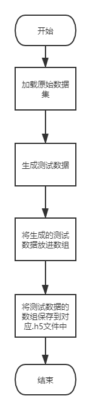
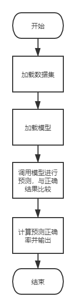
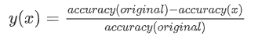

# Report

姓名：沈祎辰

学号：181250122

选题方向：AI测试大作业

数据集：CIFAR-10和CIFAR-100

## 测试数据生成

### 程序结构与思路

+ 本阶段主要使用opencv对数据进行扩增和生成，并用h5py库将生成的测试数据存储为.h5格式。

+ 思路如下（以cifar-10为例）：

  1. 调用keras.datasets.cifar10.load_data()方法，加载cifar10的训练数据集和测试数据集；为了控制变量，减少运行时间，在实际过程在我们仅统一选取训练数据集的前1000条数据，作为我们测试数据生成和后续测试数据质量评估的原始数据集。
  2. 分别编写flip_lr(), rotate_r(), bright(), gaussian(), crop(), mixUp()方法；对于其中的每一个方法，我们都建立一个空数组，遍历原始数据集，对原始数据集的每个图像做相应处理后，加入到数组中；最后将数组保存在Data/cifar-10下的对应.h5文件中。
  3. 在main方法中，调用每一个测试数据生成方法，生成测试数据。

+ 程序流程图如下：

  

### 测试数据生成方法介绍

#### 左右翻转flip_lr

+ Flip翻转包括左右翻转和上下翻转。其中，左右翻转（也叫水平翻转）在实践中比上下翻转更常见。在本次作业中，注意到上下翻转的图片可能并不具有实际意义，故仅采用左右翻转而不采用上下翻转。

+ 采用cv2实现的主要代码如下：

  ```
  img = cv2.flip(X_train[i], 1)
  ```

  其中，参数1表示是左右翻转。

#### 旋转rotate_r

+ 旋转是指，以图像的某一个点为中心点，顺时针或逆时针旋转一定角度，形成新的图片。在本次作业中，考虑的是对每张图片逆时针旋转15度。

+ 采用cv2实现的主要代码如下：

  ```
  matRo = cv2.getRotationMatrix2D((height * 0.5, width * 0.5), 15, 0.7
  img = cv2.warpAffine(img0, matRo, (height, width))
  ```

  其中，(height * 0.5, width * 0.5)表示旋转中心点的位置，在这里正好是图像的中心点；15表示逆时针旋转15度；0.7表示旋转时同时按0.7的比例进行缩放。

#### 亮度变化bright

+ 亮度变化是指，通过gamma变换，修改图像的亮度，生成新的测试数据。

+ 采用cv2实现的主要代码如下：

  ```
  img = cv2.LUT(X_train[i], table)
  ```

  其中，table是查找表，生成table的代码如下：

  ```
  gamma = 2
  invGamma = 1.0 / gamma
  table = np.array([((i / 255.0) ** invGamma) * 255 for i in np.arange(0, 256)]).astype('uint8')
  ```

#### 高斯噪声gaussian

+ 研究表明，通过给图像提供高斯噪声，虽然人眼看来对其标签的识别基本没有影响，但对于鲁棒性不好的模型却很容易出现分类错误的现象。因此，在本次作业中，我们也考虑了高斯噪声进行图像的扩增。

+ 采用cv2实现的主要代码如下：

  ```
  img = cv2.GaussianBlur(X_train[i], (5, 5), blur)
  ```

  其中，(5, 5)表示高斯矩阵的长与宽都是5，blur为0表示标准差取0。

#### 裁剪crop

+ 裁剪是指，随机地裁剪掉图像的边缘部分，而保留图像的大部分，使用这样生成的测试数据进行训练能在一定程度上提高模型的鲁棒性。

+ 采用cv2实现的主要代码如下：

  ```
  img_padding = cv2.copyMakeBorder(X_train[i], 4, 4, 4, 4, cv2.BORDER_CONSTANT, value=0)
  h = np.random.randint(0, 8)
  w = np.random.randint(0, 8)
  img = img_padding[h:h + 32, w:w + 32, :]
  ```

  其中，h和w是裁剪后图像在原始图像中的高度和宽度位置。

#### 多样本混合mixUp

+ 多样本混合是一种自己实现的方法。它是指，通过将原图像和其他两个图像以8：1：1的比例混合叠加，形成一个标签不变的新的图像。在本次作业中，主要是将图像与它之后的两个图像进行混合。

+ 实现代码如下：

  ```
  img = 0.8 * X_train[i] + 0.1 * X_train[i + 1] + 0.1 * X_train[i + 2]
  ```

### 参考文献

[1] Shorten, C., Khoshgoftaar, T.M. A survey on Image Data Augmentation for Deep Learning. *J Big Data* **6,** 60 (2019). https://doi.org/10.1186/s40537-019-0197-0

[2] A. Mikołajczyk and M. Grochowski, "Data augmentation for improving deep learning in image classification problem," 2018 International Interdisciplinary PhD Workshop (IIPhDW), Swinoujście, 2018, pp. 117-122, doi: 10.1109/IIPHDW.2018.8388338.


## 测试数据评估

### 程序结构与思路

+ 本阶段主要采用tf.keras.models.load_model()方法加载存放在.h5文件中的模型，使用model.predict()方法对某一测试数据属于各种类别的概率进行预测。

+ 思路如下（以cifar-10为例）：

  1. 加载原始数据集或测试生成数据集；
  2. 遍历模型文件所在的目录，对每个模型文件，调用tf.keras.models.load_model()，加载训练好的模型；
  3. 调用model.predict()，并取概率最大的类别序号，得到模型对数据集的预测结果；
  4. 比较正确的标签数组与预测结果的标签数组，计算预测准确率并输出。

+ 程序流程图如下：

  

### 评估指标和分析

对于某一特定模型，如果生成的测试数据集和原始数据集相比，在该模型上的预测准确率下降，那么就说明，该模型不能很好地预测我们生成的测试数据集。准确率下降的越多，就表明我们生成的测试数据对模型的鲁棒性提升的效果就越好。

由于原始数据集在各个模型上的预测准确率不尽相同，我们不能简单地以模型准确率的下降多少来评估我们生成的测试数据集的好坏，而考虑用下面的方法评估：

记 accuracy(original) 为原始数据集的预测准确率， accuracy(x) 为用方法x生成的测试数据集的预测准确率，那么我们定义测试数据集对于模型鲁棒性的提升因子 y(x) 为：



y(x)越大，说明测试数据集对于模型鲁棒性的提升越显著。

#### CIFAR-10

下表是在cifar-10上的预测准确率：

|                        | original | flip_lr | rotate_r | bright | gaussian | crop  | mixUp |
| ---------------------- | -------- | ------- | -------- | ------ | -------- | ----- | ----- |
| CNN_with_dropout       | 64.2%    | 64.8%   | 27.3%    | 65.7%  | 57.7%    | 56.7% | 65.5% |
| CNN_without_dropout    | 73.9%    | 73.3%   | 35.3%    | 67.0%  | 55.9%    | 65.6% | 71.3% |
| lenet5_with_dropout    | 67.9%    | 67.2%   | 26.3%    | 64.3%  | 55.8%    | 58.6% | 65.6% |
| lenet5_without_dropout | 74.6%    | 75.6%   | 28.4%    | 70.5%  | 63.1%    | 59.4% | 74.2% |
| random1_cifar10        | 10.8%    | 11.3%   | 10.3%    | 11.1%  | 11.1%    | 12.2% | 11.4% |
| random2_cifar10        | 12.0%    | 11.9%   | 9.8%     | 11.6%  | 12.2%    | 11.0% | 12.8% |
| ResNet_v1              | 69.8%    | 71.0%   | 25.5%    | 66.1%  | 37.8%    | 51.6% | 65.0% |
| ResNet_v2              | 70.7%    | 70.2%   | 18.0%    | 59.2%  | 26.1%    | 57.0% | 62.4% |

下表是在cifar-10上的提升因子：

|                        | original | flip_lr | rotate_r | bright | gaussian | crop   | mixUp |
| ---------------------- | -------- | ------- | -------- | ------ | -------- | ------ | ----- |
| CNN_with_dropout       | 0.0%     | -0.9%   | 57.5%    | -2.3%  | 10.1%    | 11.7%  | -2.0% |
| CNN_without_dropout    | 0.0%     | 0.8%    | 52.2%    | 9.3%   | 24.4%    | 11.2%  | 3.5%  |
| lenet5_with_dropout    | 0.0%     | 1.0%    | 61.3%    | 5.3%   | 17.8%    | 13.7%  | 3.4%  |
| lenet5_without_dropout | 0.0%     | -1.3%   | 61.9%    | 5.5%   | 15.4%    | 20.4%  | 0.5%  |
| random1_cifar10        | 0.0%     | -4.6%   | 4.6%     | -2.8%  | -2.8%    | -13.0% | -5.6% |
| random2_cifar10        | 0.0%     | 0.8%    | 18.3%    | 3.3%   | -1.7%    | 8.3%   | -6.7% |
| ResNet_v1              | 0.0%     | -1.7%   | 63.5%    | 5.3%   | 45.9%    | 26.1%  | 6.9%  |
| ResNet_v2              | 0.0%     | 0.7%    | 74.5%    | 16.3%  | 63.1%    | 19.4%  | 11.7% |

由表可知，旋转、高斯噪声、裁剪对模型鲁棒性的提升均有很大帮助；亮度变化、多样本混合对于模型鲁棒性提升有一定帮助，但效果不如旋转等明显；左右翻转对模型的鲁棒性提升几乎可以忽略。

#### CIFAR-100

下表是在cifar-100上的预测准确率：

|                        | original | flip_lr | rotate_r | bright | gaussian | crop  | mixUp |
| ---------------------- | -------- | ------- | -------- | ------ | -------- | ----- | ----- |
| CNN_with_dropout       | 42.1%    | 36.0%   | 27.3%    | 29.2%  | 22.6%    | 31.2% | 35.1% |
| CNN_without_dropout    | 80.6%    | 39.0%   | 35.3%    | 44.7%  | 33.9%    | 36.5% | 64.9% |
| lenet5_with_dropout    | 52.5%    | 36.9%   | 26.3%    | 34.2%  | 27.5%    | 25.2% | 47.0% |
| lenet5_without_dropout | 90.4%    | 33.0%   | 28.4%    | 51.7%  | 45.1%    | 23.1% | 77.9% |
| random1                | 45.7%    | 41.7%   | 9.8%     | 35.2%  | 15.8%    | 34.1% | 40.9% |
| random2                | 32.6%    | 28.8%   | 10.3%    | 20.0%  | 29.5%    | 25.2% | 27.2% |
| ResNet_v1              | 62.0%    | 35.8%   | 18.0%    | 30.7%  | 14.3%    | 31.0% | 47.1% |
| ResNet_v2              | 73.3%    | 45.9%   | 25.5%    | 32.8%  | 13.9%    | 35.2% | 54.3% |

下表是在cifar-100上的提升因子：

|                        | original | flip_lr | rotate_r | bright | gaussian | crop  | mixUp |
| ---------------------- | -------- | ------- | -------- | ------ | -------- | ----- | ----- |
| CNN_with_dropout       | 0.0%     | 14.5%   | 35.2%    | 30.6%  | 46.3%    | 25.9% | 16.6% |
| CNN_without_dropout    | 0.0%     | 51.6%   | 56.2%    | 44.5%  | 57.9%    | 54.7% | 19.5% |
| lenet5_with_dropout    | 0.0%     | 29.7%   | 49.9%    | 34.9%  | 47.6%    | 52.0% | 10.5% |
| lenet5_without_dropout | 0.0%     | 63.5%   | 68.6%    | 42.8%  | 50.1%    | 74.4% | 13.8% |
| random1                | 0.0%     | 8.8%    | 78.6%    | 23.0%  | 65.4%    | 25.4% | 10.5% |
| random2                | 0.0%     | 11.7%   | 68.4%    | 38.7%  | 9.5%     | 22.7% | 16.6% |
| ResNet_v1              | 0.0%     | 42.3%   | 71.0%    | 50.5%  | 76.9%    | 50.0% | 24.0% |
| ResNet_v2              | 0.0%     | 37.4%   | 65.2%    | 55.3%  | 81.0%    | 52.0% | 25.9% |

由表可知，旋转、高斯噪声、裁剪对模型鲁棒性的提升均有很大帮助；亮度变化、多样本混合、左右翻转对于模型鲁棒性提升也有比较大的帮助，值得被用于测试数据生成。